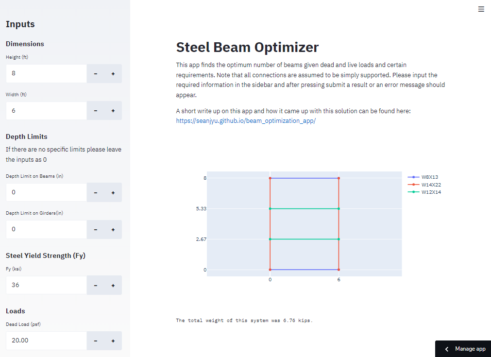

# Beam Optimization Streamlit App

This web application is designed to optimize the beam and girder gravity system's design based on dead and live loads. The elements are sized using American Wide Flange beams, and the optimization process includes determining the appropriate sizing and number of interior beams.

A more in depth documentation as to how this optimization can be found in my blog:

https://seanjyu.github.io/beam_optimization_app/

The app is hosted on streamlit and can be accessed at this website:

https://seanjyu-2023-beam-opt-app-steel-frame-optimizer-app-6ij46r.streamlit.app/

## Package Requirements  
To run this app locally the following packages must be installed. 

Streamlit (0.62.0)

Numpy (1.18.4)

Pandas (1.0.3)

Plotly (5.12.0)

## Instructions
To use the app just specify the loads and size requirements in the left pane and then press submit.
